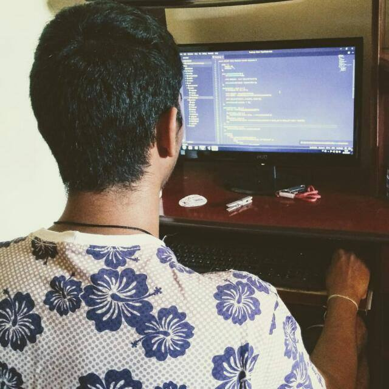

<!--
*** Obrigado por estar vendo o nosso README. Se você tiver alguma sugestão que possa melhorá-lo ainda mais, dê um fork no repositório e crie uma Pull Request ou abra uma Issue com a tag "sugestão".

*** Obrigado novamente! Agora vamos rodar esse projeto incrível :D
-->

<!-- PROJECT SHIELDS -->

[](https://www.npmjs.com/package/express)
[](https://nodejs.org/en/)
[](https://github.com/DanielFelizardoDev/backend-secury/issues)
[](https://github.com/DanielFelizardoDev/backend-secury/commits/master)

<!-- LOGO -->
<br/>
<p align="center">
  <a href="https://github.com/danielfelizardo2017">
    
  </a>

  <h3 align="center">Daniel Felizardo - FullStack Developer</h3>
</p>

<!-- TABLE OF CONTENTS -->

# Tabela de Conteúdo

- [Tabela de Conteúdo](#tabela-de-conteúdo)
- [Agradecimentos](#Agradecimentos)
- [Sobre o Projeto e Requisitos](#sobre-o-projeto-e-requisitos)
  - [Feito Com](#feito-com)
- [Começando](#começando)
  - [Pré-requisitos](#pré-requisitos)
  - [Enter Points](#Enter-Points)
  - [Estrutura de Arquivos](#estrutura-de-arquivos)
  - [Edição](#edição)
- [Contribuição](#contribuição)
- [Contato](#contato)

# Agradecimentos

Este projeto e o meu TCC-BACKEND, ele também está disponível na versão mobile, [neste link](https://github.com/DanielFelizardoDev/frontend-secury).

Antes de mais nada, gostaria de agradecer ao **IFPB - Campus Esperança**, por ter me incentivado desde o início do projeto, ao meu orientador **Ramon Nóbrega**, muito obrigado por ter me ajudado a seguir em frente e deixar tudo que é ruim para trás, como também a minha família e amigos, sem eles não estaria concluindo este trabalho.

<!-- ABOUT THE PROJECT -->

# Sobre o projeto e Requisitos

Este projeto foi pensado juntamente com meu orientador e outras entidades do IFPB, a enfatizarem a questão da segurança. Podemos ver diariamente pessoas vítimas de assalto, sendo assim feridas ou mortas, por não ter chegado mais rápido a viatura, ou algum policial não estar presente naquele local, isto é um **problema**, que pode ser **solucionado**. O motivo pelo qual foi colocado essa ideia em prática, foi por causa da falta de um atendimento mais rápido entre a **polícia** e o **usuário**.

Então, este projeto não só ajudará a ter o meu diploma de Técnico em Informática, mas contribuirá com a sociedade, para que possamos estar mais "seguros".

Os requesitos desta aplicação para o backend é: Ter uma forma de login para o usuário e ao policial; Autênticação por email, para teste foi feito com o MailTrap(SMTP); Ter a funcionalidade de enviar ocorrências em tempo real para o policial.

## Feito Com

Abaixo segue o que foi utilizado na criação deste projeto:

- [body-parser](https://www.npmjs.com/package/body-parser/) - O body-parser é um middleware de análise de corpo do Node.js. Analisa corpos de requisição de entrada em um middleware antes de seus manipuladores, disponíveis sob a `req.body` propriedade.
- [cors](https://www.npmjs.com/package/cors) - O cors é um package para oferecer um middleware de connection para o Express.
- [Express](https://www.npmjs.com/package/express) - O Express é uma ferramenta utilizada para capitar requisições do servidor e mostrar para o cliente.
- [express-handlebars](https://www.npmjs.com/package/express-handlebars) - O Express Handlebars é um package engine para formatação de layouts, que é dependente do pacote `Handlebars`.
- [gerador-validador-cpf](https://www.npmjs.com/package/gerador-validador-cpf) - Basicamente, esse package tem a funcionalidade de validar o cpf.
- [handlebars](https://www.npmjs.com/package/handlebars) - O Handlebars, é um package de formatação de layouts, podendo ter a funcionalidade de trocar o engine para outros tipos de arquivos de layout.
- [jsonwebtoken](https://www.npmjs.com/package/jsonwebtoken) - O jwt, tem a funcionalidade de gerar um token de autênticação para o usuário.
- [mongoose](https://www.npmjs.com/package/mongoose) - O Mongoose, permite criar entidades e relacionamentos, a partir de classes.
- [nodemailer](https://www.npmjs.com/package/nodemailer) - O Nodemailer, tem como função enviar email formatado para algum usuário.
- [nodemailer-express-handlebars](https://www.npmjs.com/package/nodemailer-express-handlebars) - Este pacote tem como função referenciar um certo tipo de requisição para a entrega de emails.
- [socket.io](https://www.npmjs.com/package/socket.io) - Este pacote tem como objetivo integrar requisições asyncronas entre usuários.

<!-- GETTING STARTED -->

# Começando

Ao começar este projeto pude perceber o quão foi complicado usar as tecnologias com o **Node**. Este foi o meu primeiro contato, como projeto pessoal, sei que ainda precisa de muitos ajustes, caso você encontre algum erro, ou queira nos ajudar a este projeto crescer crie uma [issue](https://github.com/danielfelizardo2017/backend-secury/issues).

Antes de imigrar para essa tecnologia, foi preciso estudar sobre **JavaScript**. Essa tecnologia tem várias atualizações, e a que mais foi preciso ter um pouco mais de atenção, foi a **EcmaScript**, com isso, a complexidade que havia em entender cada funcionalidade, foi abrindo meus olhos e podendo enxergar o quão poderosa ela é.

Quando conheci o **NodeJS**, que também está escrito em JavaScript, foi então que decidi a tecnologia que iria usar no projeto. Juntamente com o NPM e o Yarn, que são geradores de pacotes, deixa tudo mais fácil a comunicação no servidor. Para criar um servidor simples em nodeJS, é utilizado o **Express**, que por sua vez, habilita uma porta para o cliente, ter acesso aos serviços da API. Para criar o arquivo de server da aplicação, dentro do projeto, crie o arquivo `server.js` e adicione o seguinte conteúdo, mas antes de criar o arquivo, adicione a dependência `Express` no seu projeto, executando o seguinte comando no CMD:

```
  $ npm install express --save
```

Agora você pode criar o arquivo e adicionar o seguinte conteúdo:

```
  const express = require("express");

  const app = express();

  app.get("/", async (req, res){
    console.log("Teste");
  });

  app.listen(3333);
```

Para testar a aplicação, basta rodar o seguinte comando no CMD:

```
  $ node server.js
```

Este é um exemplo utilizando apenas poucas linhas de código, para ter o servidor rodando na sua máquina.

## Pré-requisitos

Para estar efetivamente utilizando este projeto para suas aplicações, você precisará ter conhecimento básico em JavaScript.

## Enter Points

Enter points, é a navegação pelo qual se faz requisições seja ela get, post, put ou delete. Dentre elas, vou separar por: Authenticate e Controllers

- **Authenticate**

  Para se autenticar na nossa aplicação, o usuário decidirá qual tipo de serviço ele quer usar, como Policial ou Usuário comum. O arquivo se localiza no caminho `src/app/controllers/authController.js`, caso ele queira utilizar a autenticação policial, será utilizado as seguintes rotas:

  ```
    METHOD:POST http://localhost:3333/auth/register/police
    METHOD:POST http://localhost:3333/auth/authenticate/police
    METHOD:POST http://localhost:3333/auth/forgot_password/police
    METHOD:POST http://localhost:3333/auth/reset_password/police
  ```

  Já para o usuário comum, ele utilizará as seguintes rotas:

  ```
    METHOD:POST http://localhost:3333/auth/register/user
    METHOD:POST http://localhost:3333/auth/authenticate/user
    METHOD:POST http://localhost:3333/auth/forgot_password/user
    METHOD:POST http://localhost:3333/auth/reset_password/user
  ```

  Todas as requisições da autenticação, são utilizadas com o método POST.

* **Controllers**

  Para controlar as ocorrências e manter um funcionamento entre as entidades e relacionamentos, foi criado o arquivo `src/app/controllers/TaskController.js`, para guardar toda a na nossa aplicação. Caso seja ele policial, terá acesso a essas rotas:

  ```
    METHOD:POST    http://localhost:3333/task/:id
    METHOD:POST    http://localhost:3333/task/list
    METHOD:POST    http://localhost:3333/task/completed/:id
  ```

  Já para o usuário comum, ele utilizará as seguintes rotas:

  ```
    METHOD:POST    http://localhost:3333/task/
    METHOD:PUT     http://localhost:3333/task/:id
    METHOD:DELETE  http://localhost:3333/task/:id
    METHOD:POST    http://localhost:3333/task/list/:id
  ```

## Estrutura de Arquivos

A estrutura de arquivos está da seguinte maneira:

```bash
  backend
  ├── src/
  │   ├─── app/
  │   │   ├── controllers/
  │   │   ├── middleware/
  │   │   └── models/
  │   ├─── assets/
  │   ├─── config/
  │   ├─── database/
  │   ├─── modules/
  │   ├─── resources/
  │   │   └── mail/
  │   │      └── auth/
  │   │         ├── police/
  │   │         └── user/
  │   └─── server.js/
  ├── .editorconfig
  ├── .gitignore
  ├── package.json
  ├── Procfile
  ├── README.md
  └── yarn.lock
```

Serão explicados os arquivos e diretórios na seção de [Edição](#edição) logo a seguir.

# Edição

Nesta seção haverão instruções caso você queira editar o projeto, explicando para que os diretórios são utilizados e também os arquivos de configuração.

- **src** - Neste diretório onde é guardado todo Design Patterns da aplicação, que para este caso foi utilidado o MV.

  - **app** - Diretório onde é guardado os controllers e os models da aplicação.

    - **controllers** - Pasta onde está sendo guardado os controllers do projeto.
    - **middleware** - Pasta onde está sendo armazenado o arquivo de autenticação.
    - **models** - Pasta onde está sendo armazenado os arquivos de models do projeto.

  - **assets** - Diretório onde é guardado as imagens do projeto.

  - **config** - Diretório onde é guardado as configurações do projeto.

  - **database** - Diretório onde é guardado o arquivo de link para o banco de dados.

  - **modules** - Diretório onde é guardado o arquivo de configuração do template handlebars.

  - **resoucers** - Diretório onde é guardado os arquivos de template em html para envio de email.

    - **mail** - Diretório de email.
      - **auth** - Diretório de email de autênticação.
        - **police** - Pasta de templates para a policial.
        - **user** - Pasta de templates para o usuário.

  - **server.js** - Arquivo raiz da aplicação, também chamado de _Entry Point_, é o primeiro arquivo chamado no momento do build e execução da aplicação, nele é chamado o arquivo `index.js` que por sua vez chama as rotas da aplicação.

- **.editorconfig** - Arquivo de configuração se caso mais pessoas utilizarem este código em outros editores de texto, mantenha a sua identação.
- **.gitignore** - Arquivo de configuração do **git** para ignorar arquivos como o `node_modules` existente de muito espaço, para que não seja exportado para alguma plataforma de repositório.

* **package.json** - Diferente dos projetos comuns, esse arquivo tem as configurações necessárias e para o link da referência da pasta `node_modules`.

- **Procfile** - Arquivo de configuração do `Heroku`, para instalar as libs do seu projeto online.

* **README.md** - Arquivo de leitura do projeto, tais como o auxílio de outros programadores utilizarem como base.

* **yarn.lock** - Arquivo de cache do gerenciador de pacotes Yarn.

<!-- CONTRIBUTING -->

# Contribuição

Contribuições são o que fazem a comunidade open source um lugar incrível para aprender, inspirar e criar. Qualquer contribuição que você fizer será **muito apreciada**.

1. Faça um Fork do projeto
2. Crie uma Branch para sua Feature (`git checkout -b feature/FeatureIncrivel`)
3. Adicione suas mudanças (`git add .`)
4. Comite suas mudanças (`git commit -m 'Adicionando uma Feature incrível!`)
5. Faça o Push da Branch (`git push origin feature/FeatureIncrivel`)
6. Abra uma Pull Request

<!-- CONTACT -->

# Contato

Daniel Felizardo - [Github](https://github.com/danielfelizardo2017) - **daniel.david772@gmail.com**
